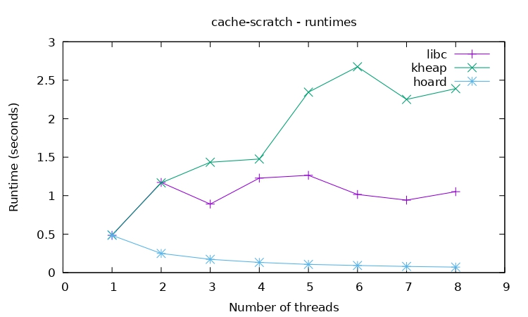
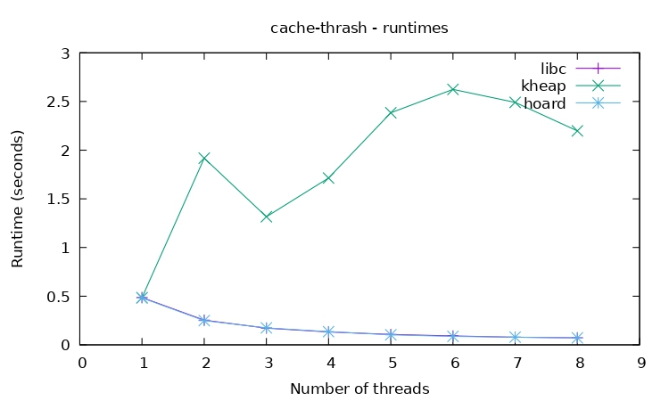
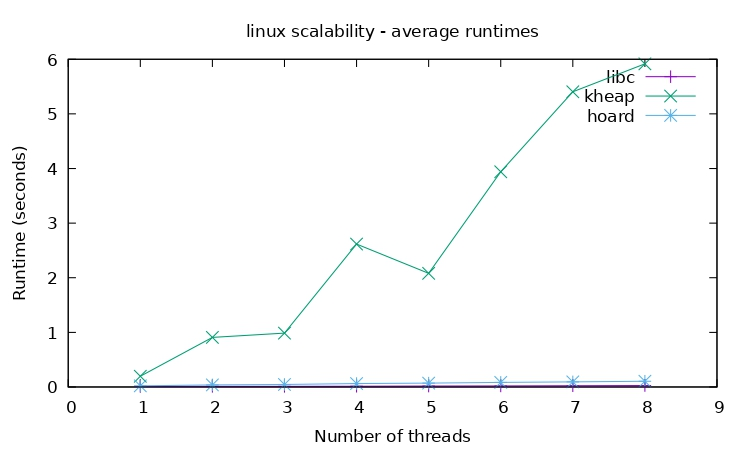
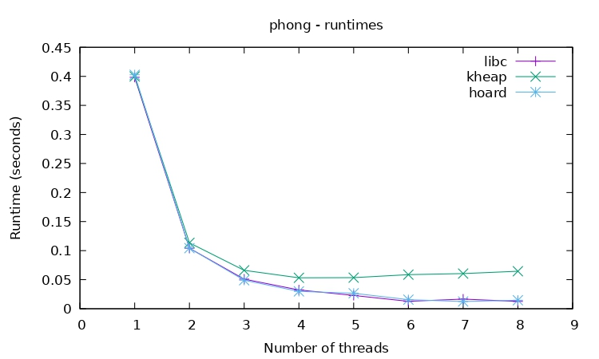
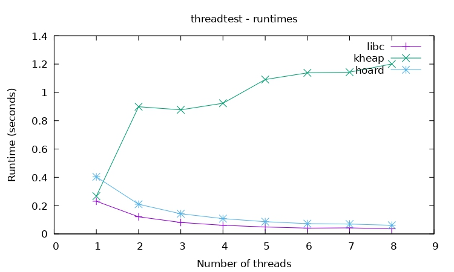

# Hoard: a Scalable Memory Allocator 
A C implementation of the Hoard memory allocator. The implementation is located in allocators/horad-alloc. 

## Implementation details:
1. pointers to super-block reference and owner heap are stored at the beginning of each super-block, so when we free a block of memory we can shift to the head of its super-block and find its owner, the whole operation takes constant time. However, this approach might leads to internal fragmentation in some scenarios. Another approach is store these pointers at the top of the heap while spacial locality is the mean concern for this method.
2. In my implementation, one bin is reserved for completely full super-blocks so we can avoid checking if a super-block is full when we allocate block. 

## Benchmark results:

## How to run the benchmark:
1. cd into top directory of the project, run `export TOPDIR=$(pwd)`
2. run `make all`
3. cd into the benchmark directory, you can run `./runall ./` to run all benchmarks or `./runbench` to run a particular benchmark
